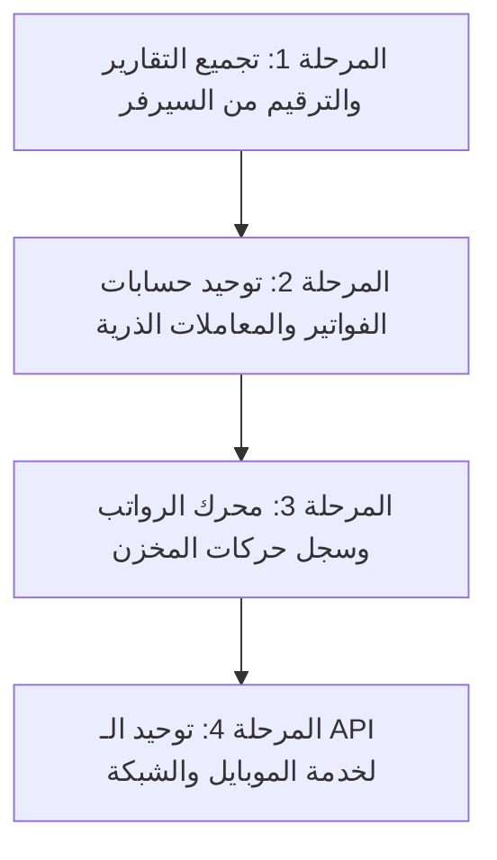

# خارطة الطريق الهندسية: نقل المنطق البرمجي والعمليات الحسابية من الواجهة إلى الباك إند (Architectural Blueprint)

> **الهدف الاستراتيجي:** تحويل النظام إلى بنية قائمة على **الواجهة الخفيفة (Thin Client)** و**محرك الأعمال الخلفي المتين (Smart Backend Engine)**، لضمان استقرار وسرعة البرنامج بعد 3 إلى 5 سنوات مع تضخم البيانات لمئات الآلاف من السجلات، وتجهيزه للربط مع تطبيق الموبايل (Android) ونقاط البيع المتعددة.

---

## 1. ملخص المشهد الحالي مقابل البنية المستهدفة

| المعيار | الوضع الحالي (Frontend-Heavy) | الوضع المستهدف (Backend-Driven Architecture) | العائد على المدى البعيد |
| :--- | :--- | :--- | :--- |
| **مكان الحسابات** | داخل متصفح الواجهة (DOM / JS Renderer) | داخل محرك SQLite و Node.js المرجعي | دقة حسابية مطلقة ومنع فروق الكسور |
| **التقارير والبيانات الكبيرة** | سحب كافة الفواتير (Full Dump) والفلترة بالذاكرة | ترقيم من السيرفر (`LIMIT / OFFSET`) واستعلامات `SUM` | استجابة فورية (أقل من 50ms) واستهلاك رام شبه معدوم |
| **المعاملات المالية** | طلبات IPC متعددة متتالية لكل إجراء | معاملة ذرية واحدة (`db.transaction()`) لا تتجزأ | منع تلف البيانات حتى لو انقطع التيار الكهربائي |
| **التحقق والفلترة** | التحقق وتنظيف الفواصل داخل الأحداث بالواجهة | طبقة تحقق صارمة (Validation Layer) بالباك إند | أمان شامل وحماية لقاعدة البيانات من أي قيم مشوهة |
| **التوافق مع الأجهزة الأخرى** | إعادة كتابة الحسابات لكل واجهة جديدة (أندرويد) | واجهة برمجة موحدة (RPC/REST) تخدم كافة المنصات | توفير 70% من وقت وتكلفة تطوير تطبيق الموبايل |

---

## 2. التحليل التفصيلي حسب أقسام النظام

### أ. التقارير العامة وكشوفات الحسابات (Reports & Statements)
- **الوضع الحالي:**
  - عند الضغط على "بحث" في التقارير، يتم استدعاء `getAllReports` لجلب كافة السجلات في الفترة المحددة.
  - تقوم الواجهة بعمل حلقات تكرارية (`.filter()` و `.reduce()`) لحساب إجمالي المبيعات، إجمالي المشتريات، عدد السندات، والقيم المالية.
  - يتم عمل تقسيم الصفحات (Pagination) في ذاكرة المتصفح (`reports.slice(start, end)`).
- **المخاطر المستقبلية:**
  - عند تراكم 50,000 إلى 200,000 فاتورة بعد سنتين أو ثلاث، سيؤدي تحميل هذه البيانات عبر جسر IPC إلى استهلاك مئات الميجابايت من الرام وحدوث تجميد كامل (UI Freeze) للواجهة لعدة ثوانٍ.
- **الحل الاحترافي في الباك إند:**
  1. **الترقيم من السيرفر (Server-Side Pagination):** جلب 20 فاتورة فقط بالصفحة عبر `LIMIT 20 OFFSET ?`.
  2. **التجميع المباشر بمحرك SQL:** حساب الإجماليات عبر استعلام تجميعي واحد (`SELECT COUNT(*), SUM(total_amount) ...`) يستفيد من الفهارس (Indexes) ويعود بالنتيجة في 5 أجزاء من الألف من الثانية.
  3. **كشوف حسابات العملاء:** حساب الرصيد التراكمي (Running Balance) في الباك إند باستخدام دوال النوافذ (`SUM() OVER (...)`) بدلاً من تجميعها بالواجهة.

---

### ب. لوحة التحكم والمؤشرات الحيوية (Dashboard & Business Intelligence)
- **الوضع الحالي:**
  - الواجهة تجمع البيانات وتطلب استعلامات منفصلة للمبيعات والمصروفات والرسم البياني اليومي.
  - بناء مصفوفات الأيام وتطابق التواريخ يتم جزئياً في جافاسكريبت الواجهة.
- **الحل الاحترافي في الباك إند:**
  1. **نقطة نهاية موحدة (Single Dashboard Snapshot):** توفير استعلام متكامل يعيد كائن إحصائي كامل جاهز للعرض مباشرة.
  2. **ذاكرة تخزين مؤقتة للمؤشرات التاريخية (Cached Historical Aggregates):** مؤشرات الأشهر السابقة أرقام ثابتة لا تتغير؛ حفظها في جدول ملخصات يلغي الحاجة لإعادة فحص كل فواتير السنوات السابقة عند كل فتح للبرنامج.
  3. **تجهيز الرسوم البيانية في الباك إند:** إرجاع مصفوفات الأيام والإيرادات جاهزة للمخطط البياني (Chart Ready Payload) دون حاجة الواجهة لإنشاء تواريخ ومطابقتها.

---

### ج. فواتير البيع والشراء (Sales & Purchases Financials)
- **الوضع الحالي:**
  - الواجهة تحسب الصافي والخصم النسبي/المبلغ والضريبة والمتبقي live أثناء كتابة المستخدم وترسل القيم النهائية للباك إند.
- **المخاطر المستقبلية:**
  - احتمالية حدوث فروقات طفيفة بسبب حسابات الفواصل العائمة (Floating Point Precision) بين المتصفحات، أو في حال تعديل الفاتورة من أكثر من مكان.
- **الحل الاحترافي في الباك إند:**
  1. **الباك إند هو المرجع الحسابي الوحيد (Single Source of Truth):** الواجهة ترسل فقط معرفات الأصناف والكميات وأسعار البيع، والباك إند يعيد احتساب الصافي والخصوم وتخزينها، ويعيد الكائن الموثق للواجهة.
  2. **المعاملة الذرية المركبة (Compound Transaction):**
     حفظ الفاتورة يجب أن يتم داخل `db.transaction()` مغلقة تقوم بالآتي معاً:
     - إدراج رأس الفاتورة وتفاصيل البنود.
     - خصم كميات المخزون والتحقق من توفر الكمية.
     - إنشاء حركة الخزينة وتحديث رصيد الصندوق.
     - تعديل كشف حساب العميل أو المورد.
     *(إذا فشل أي سطر، يتم التراجع عن العملية بالكامل فوراً وتلقائياً لمنع أي خلل).*

---

### د. تقييم المخزون وحركة الأصناف (Inventory Valuation & Stock Balances)
- **الوضع الحالي:**
  - يتم استرجاع كل الأصناف، وتقوم الواجهة بحساب إجمالي قيمة المخزون عبر ضرب `cost_price * stock_quantity` داخل كود الواجهة، والبحث والتصفية في جدول الأصناف بالذاكرة.
- **الحل الاحترافي في الباك إند:**
  1. **حساب التقييم في قاعدة البيانات:** استعلام `SELECT COALESCE(SUM(cost_price * stock_quantity), 0) FROM items` سريع للغاية ودقيق.
  2. **سجل حركة المخزون التراكمي (Stock Movement Ledger):** جدول حركات مخزنية يسجل (وارد / صادر / تسوية) لكل صنف، مما يتيح للعميل استخراج كشف حركة لأي صنف خلال 5 سنوات سابقة دون أدنى بطء.

---

### هـ. إدارة العمال والرواتب والتحضير (Workers Payroll & Attendance)
- **الوضع الحالي:**
  - معالجة جداول الحضور، خصومات السلف، واحتساب صافي الأجر الأسبوعي/الشهري يتم عبر معالجة مصفوفات في جافاسكريبت الواجهة.
- **الحل الاحترافي في الباك إند:**
  1. **محرك الرواتب المستقل (Payroll Engine):** حساب المستحقات والغياب والسلف في استعلام مجمّع يغلق الفترة المالية للعامل ويصدر قيداً محاسبياً مثبتاً.
  2. **سجل تدقيق مالي (Audit Trail):** تسجيل توثيق آلي لكل تعديل على أجر أو خصم سلفة مع اسم المستخدم وتاريخ الإجراء.

---

### و. التحقق من المدخلات وتنظيف البيانات (Validation & Normalization)
- **الوضع الحالي:**
  - تنظيف فواصل الآلاف والتحقق من القيم السالبة أو غير الصالحة يحدث في أحداث الواجهة (`oninput`, `onchange`).
- **الحل الاحترافي في الباك إند:**
  1. **طبقة حماية مركزية (Unified Validation Layer):** تفحص كل مصفوفة أو رقم وارد قبل لمس قاعدة البيانات، وتضمن عدم قبول قيم فارغة، سالبة غير مسموحة، أو نصوص مشوهة.
  2. **توحيد صيغ التواريخ والأرقام:** ضمان تخزين كافة التواريخ بصيغة `ISO 8601 (YYYY-MM-DD HH:mm:ss)` بدقة متناهية.

---

## 3. خطة التنفيذ المقترحة على مراحل آمنة (Roadmap)

1. **المرحلة الأولى (بدون أي مخاطر - قراءة فقط):**
   - نقل ترقيم صفحات التقارير العامة (`Server-Side Pagination`).
   - استخراج إجماليات ملخصات التقارير مباشرة من SQLite.
2. **المرحلة الثانية (سلامة البيانات):**
   - اعتماد `db.transaction()` المركزية لعمليات حفظ الفواتير وحركات الخزينة.
   - جعل احتساب الإجماليات والخصومات دالة مرجعية في الباك إند.
3. **المرحلة الثالثة (المخزون والعمال):**
   - إضافة جدول حركات المخزون وسيرفر تقييم البضاعة.
   - توفير دالة احتساب الرواتب الشاملة من السيرفر.
4. **المرحلة الرابعة (الجاهزية التامة للموبايل):**
   - توحيد قنوات الـ RPC لتصبح RESTful / JSON-RPC endpoints قياسية، ليتمكن تطبيق الأندرويد من العمل فوراً دون الحاجة لبرمجة أي منطق حسابي إضافي.

---

## 4. المردود المباشر على العميل وتجربة الاستخدام

1. **انعدام البطء بعد سنوات:** يظل البرنامج يفتح في ثانية واحدة ويعرض التقارير في لمح البصر مهما بلغ عدد الفواتير أو السنوات.
2. **استقرار الذاكرة وحماية النظام:** استهلاك رام منخفض وثابت لا يتزايد مع كبر حجم قاعدة البيانات.
3. **أمان البيانات المالي:** استحالة تكرار الفواتير أو تسجيل حركة خزينة دون خصم من المخزون أو رصيد العميل.
4. **سهولة التوسع:** إمكانية ربط أجهزة متعددة أو إطلاق تطبيق الهاتف للمناديب أو الإدارة في أي وقت بسلاسة تامة.
