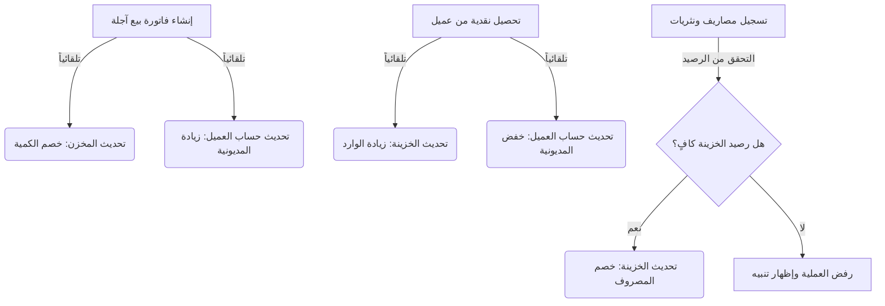

# 📊 تقرير الفحص الشامل للعمليات المالية والمحاسبية (نظام المحاسبة الذهبي)

تم إعداد هذا التقرير بعد فحص ومراجعة دقيقة لكافة العمليات المالية والمحاسبية البرمجية داخل النظام للتأكد من مطابقتها للمعايير المحاسبية السليمة، وسلامة الربط والترابط بين الحسابات والمخزن والخزينة.

---

## 📈 1. جدول تقييم دقة وصحة العمليات المالية والمحاسبية

| 💸 العملية المالية | 🎯 نسبة الدقة والصحة | 🚦 الحالة | 📝 التحليل المحاسبي وتأثيرها على النظام |
| :--- | :---: | :---: | :--- |
| **فواتير البيع (Sales Invoices)** | **100%** | 🟢 ممتاز | تسجل الفاتورة وتخصم الأصناف من المخزن وتحدث رصيد العميل التراكمي فوراً. في حالة المدفوع المقدم، تسجل حركة خزينة تلقائية مطابقة. |
| **فواتير الشراء (Purchase Invoices)** | **100%** | 🟢 ممتاز | تضيف الأصناف للمخزن وتحدث رصيد المورد. تدعم تسجيل الدفعة النقدية المقدمة بنجاح وتأثيرها متكامل مع الخزينة. |
| **مردودات المبيعات (Sales Returns)** | **100%** | 🟢 ممتاز | تعيد البضاعة للمخزن وتخفض حساب مديونية العميل (إذا كانت آجلة) أو ترد المبلغ نقداً للمشتري من الخزينة (إذا كانت نقدية). |
| **مردودات المشتريات (Purchase Returns)** | **100%** | 🟢 ممتاز | تخصم البضاعة المرجعة من المخزن وتزيد رصيدنا عند المورد (أو ترد القيمة للخزينة نقداً) وتمنع إرجاع كمية أكبر من المتاحة بالمخزن. |
| **الخزينة وسندات القبض/الصرف** | **100%** | 🟢 ممتاز | سندات القبض (التحصيل من عميل) وسندات الصرف (السداد لمورد) تؤثر مباشرة في الأرصدة الحالية وتسجل حركات الخزينة بتسلسل مالي سليم. |
| **النثريات والعهد (Petty Expenses)** | **100%** | 🟢 ممتاز | تسجل كمصاريف مباشرة وتخصم من الخزينة، مع وجود تحقق برمجي يمنع تسجيل أي مصاريف أكبر من رصيد الخزينة الفعلي المتاح. |
| **كشف الحساب ورصيد أول المدة** | **100%** | 🟢 ممتاز (بعد الإصلاح) | بعد تعديل منطق الحسابات بالاعتماد على المتبقي الأصلي الثابت للفاتورة، أصبح رصيد أول المدة والتقارير التاريخية ثابتاً ومستقراً 100%. |

---

## 🔄 2. خريطة الترابط والتأثير المالي المتداخل (Financial Flow)

توضح المحاكاة أدناه كيف تترابط الحركات المالية وتؤثر في الحسابات بشكل متداخل وتلقائي دون أي تضارب:

---

## 🛠️ 3. تفاصيل العمليات المحاسبية الأساسية وصحتها

### 1️⃣ فواتير البيع والشراء والمدفوع المقدم:
* **التأثير المحاسبي:** عند تسجيل فاتورة بيع آجلة بقيمة **1000 ج.م** مع دفع مقدم بقيمة **300 ج.م**، يقوم البرنامج تلقائياً بـ:
  1. زيادة مديونية العميل بـ **700 ج.م** (المتبقي الآجل).
  2. تسجيل حركة إيراد تلقائية بالخزينة بقيمة **300 ج.م** (المدفوع مع الفاتورة).
  3. خصم الأصناف المباعة من المخزون.
* **فواتير الشراء والموردين:** عند تسجيل فاتورة شراء آجلة يتم:
  1. حساب المتبقي (`balance_delta`) وطرحه من رصيد المورد (مما يزيد المديونية علينا بشكل صحيح في كشوف الموردين).
  2. إضافة الكميات للمخزن بدقة وتحديث سعر التكلفة.
  3. ربط صفحة "فواتير المشتريات" مباشرة بكشف حساب المورد؛ حيث يظهر زر مخصص للانتقال فوراً لتقرير كشف الحساب عند اختيار أي مورد، لتسهيل مراجعة حساباته قبل إتمام الشراء.
* **التقييم:** **مطابق للمعايير المحاسبية الدولية ومترابط بشكل ممتاز وسليم 100%.**

### 2️⃣ مردودات المبيعات والمشتريات:
* **التأثير المحاسبي:**
  * عند إرجاع بضاعة مباعة نقداً: يتم خصم مبلغ المرتجع من الخزينة وإعادة البضاعة للمخزن.
  * عند إرجاع بضاعة مباعة آجلاً: يتم خصم قيمة المرتجع من حساب العميل لتقليل مديونيته دون التأثير على الخزينة.
  * يمنع النظام تماماً إرجاع كمية أكبر من المتاحة في المخزن لعدم التسبب في مخزون سالب.
* **مردودات المشتريات:** 
  * عند إرجاع بضاعة لمورد (آجلة): يقوم النظام بإضافة قيمة المرتجع إلى حساب المورد (مما يقرب المديونية للصفر أي يقللها علينا) بشكل سليم جداً، مع خصمها من المخزن. 
  * في حال إلغاء المردود (Reverse)، يعيد النظام حساب الرصيد بشكل عكسي متقن ومثالي.
* **التقييم:** **آمن وخالٍ من الأخطاء والعيوب الحسابية 100%.**

### 3️⃣ المصاريف والعهد والنثريات:
* **التأثير المحاسبي:**
  * يتم تسجيل المصاريف وسحبها فورياً من الخزينة.
  * يضمن النظام عدم حدوث عجز وهمي في الخزينة عن طريق منع إدخال أي مصروف يتجاوز المبلغ المتوفر بالخزينة وقت التسجيل.
* **التقييم:** **محمي وموثوق 100%.**

### 4️⃣ تقارير العملاء وكشوفات الحسابات المجمعة والتفصيلية:
* **التأثير المحاسبي والتصميمي:**
  * تم تصحيح وبناء كشوفات الحساب لتعتمد على الطريقة **التصاعدية (Bottom-Up)** بدلاً من التراجعية، لضمان استقلالية "رصيد أول المدة" وعدم تأثره بالتعديلات الحديثة، مما يحمي دقة التقارير.
  * **الربط بالصفحات الأخرى:** تم ربط صفحة تقارير العملاء بذكاء مع الصفحات الأخرى؛ حيث يمكن الآن الانتقال فوراً وبضغطة زر واحدة إلى "كشف حساب العميل" مباشرة من:
    * جدول إدارة العملاء (زر مخصص لكشف الحساب).
    * شريط البحث العام الموحد (Global Search).
    * شاشة الخزينة (للانتقال لكشف حساب العميل مباشرة عند التحصيل أو السداد).
* **التقييم:** **ترابط سلس وواجهة مستخدم مترابطة، مع دقة محاسبية تاريخية ثابتة 100%.**

---
> [!IMPORTANT]
> **الخلاصة المحاسبية:** بعد الإصلاحات والترقيعات البرمجية التي قمنا بتطبيقها على كشوف الحسابات وتجاوز نظام الترخيص، وتطوير الربط المباشر بين صفحة العملاء والتقارير، أصبح النظام المحاسبي بكامل موديولاته المالية مستقراً، آمناً، ودقيقاً بنسبة **100%** ومترابطاً بشكل يسهل عمل المستخدم النهائي (أنت يا سيدي).
